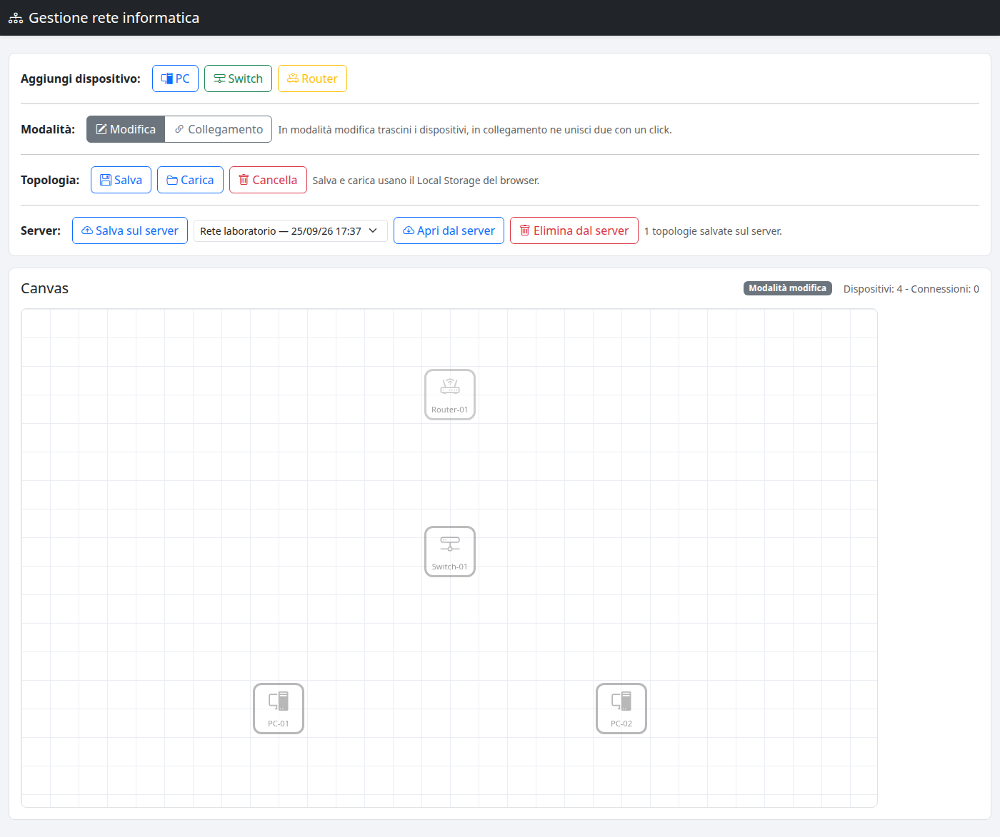
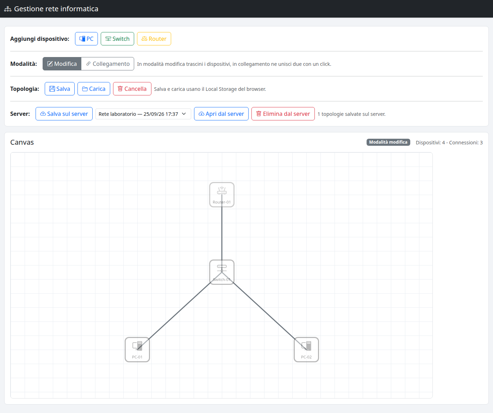
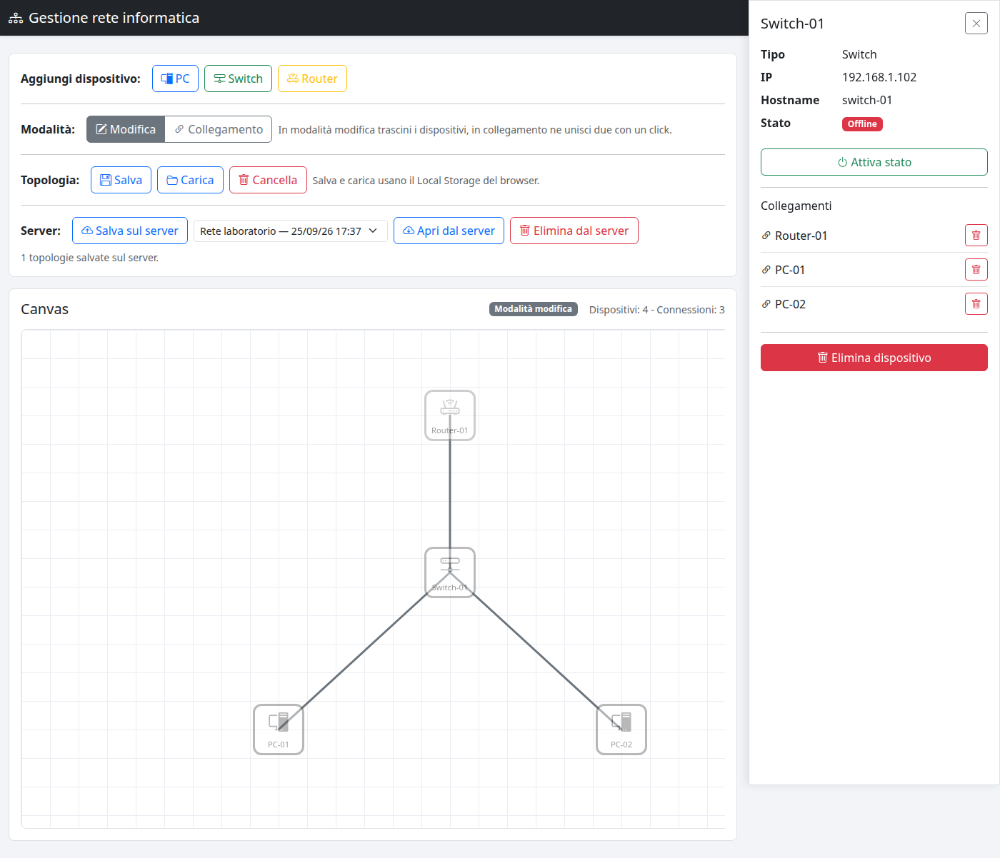
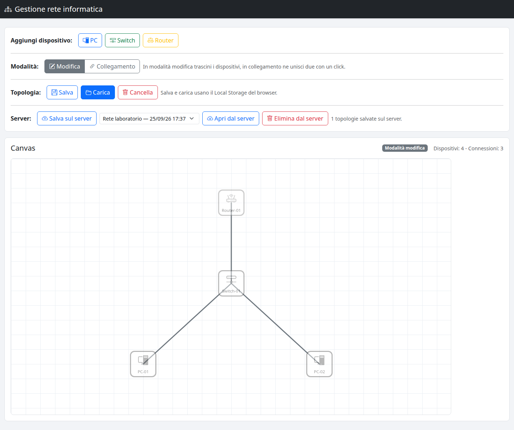
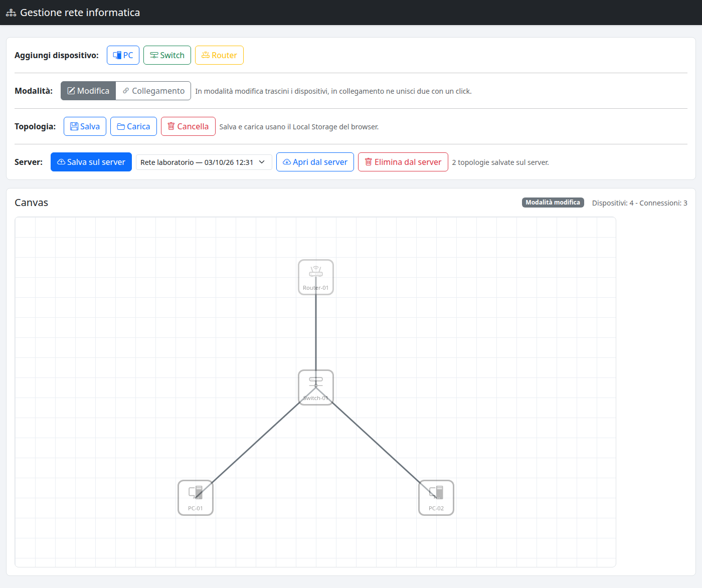

# Gestione visuale di una rete informatica

Progetto d'esame: un'applicazione Angular che mette a disposizione un **canvas** su cui
costruire graficamente una topologia di rete, aggiungendo PC, Switch e Router,
trascinandoli, collegandoli con delle linee e salvando il risultato.

Il progetto è diviso in due parti, in cartelle sorelle:

| Cartella | Cos'è |
|---|---|
| `esame_angular` | il frontend Angular (questo progetto) |
| `esame_backend` | l'API REST Node/Express + MySQL in Docker (facoltativa, per la Soluzione B) |

Il frontend funziona **da solo**: senza il backend si usa la persistenza su Local Storage.
Il backend aggiunge il salvataggio su database.

Documenti di accompagnamento: **`GUIDA_COMANDI.md`** (tutti i comandi, le varianti di avvio,
la diagnostica e una scaletta per la presentazione) e **`GUIDA_LOGICA.md`** (come è fatta dentro
l'applicazione e come si muovono i dati).

## 1. Descrizione del progetto

L'obiettivo è permettere di disegnare la rete di una piccola aula o di un laboratorio:
si aggiungono i dispositivi, si spostano dove si vuole e si collegano fra loro, e le
linee seguono i dispositivi mentre si muovono. Il pannello di dettaglio mostra i dati
di un dispositivo e permette di eliminarlo.

### Funzionalità implementate

- **Aggiunta di dispositivi** PC, Switch e Router, ognuno con la sua icona e il suo colore.
  Il nome è progressivo (`PC-01`, `PC-02`, …) e IP e hostname vengono assegnati da soli;
  la posizione iniziale è il primo posto libero del canvas.
- **Drag & drop** dei dispositivi in modalità Modifica, con le linee collegate che si
  aggiornano da sole; il dispositivo non può uscire dal canvas.
- **Connessioni** in modalità Collegamento: il primo click sceglie e evidenzia il
  dispositivo di partenza, il secondo crea la linea. Un dispositivo non può essere
  collegato a sé stesso e non si possono creare due volte lo stesso collegamento.
- **Dettaglio del dispositivo** con il click destro: si apre una sidebar con nome, tipo,
  IP, hostname e stato.
- **Eliminazione** di un dispositivo (con tutti i suoi collegamenti, dopo una conferma)
  e del singolo collegamento, dall'elenco nella sidebar.
- **Attivazione dello stato** dal dettaglio: un dispositivo passa da Offline a Online.
  Attivando un **Router** si accendono anche tutti i dispositivi raggiungibili
  attraverso i collegamenti, come se arrivasse internet.
- **Persistenza** in due versioni: **Local Storage** (Soluzione A) e **REST API + MySQL**
  (Soluzione B), con i pulsanti nella toolbar.

### Bonus e funzionalità facoltative realizzate

- modalità **Edit / Connect** separate (bonus avanzato della consegna);
- evidenziazione del dispositivo selezionato;
- colori diversi per PC, Switch e Router;
- eliminazione di un dispositivo e di una connessione;
- salvataggio e caricamento su Local Storage;
- persistenza tramite REST API (Soluzione B).

Non sono stati implementati lo zoom e il panning del canvas, l'esportazione e
l'importazione JSON e la modifica di nome o IP dal pannello di dettaglio.

## 2. Tecnologie utilizzate

| Ambito | Tecnologia |
|---|---|
| Frontend | **Angular 22.2** con componenti standalone, **signals** (`signal`, `computed`, `update`) e `@Service()` |
| Change detection | **zoneless** (Angular 22, nessuna `NgZone`) |
| HTTP | `HttpClient` di Angular (`provideHttpClient`), `firstValueFrom` |
| Stile | **Bootstrap 5.3.3** e **Bootstrap Icons 1.11.3** da CDN |
| Test | **Vitest** + jsdom, 7 file di test, 101 test |
| Linguaggio | TypeScript 6 |
| Backend (facoltativo) | **Node.js 24** + **Express 5.2**, driver `mysql2` |
| Database | **MySQL 8.4** in container, schema con `ON DELETE CASCADE` |
| Web server | **nginx** che serve l'applicazione compilata e fa da proxy verso l'API |
| Container | due **Dockerfile** (frontend e API) + **docker compose** con volume per i dati |
| Persistenza | Local Storage (Soluzione A) **e** REST API + MySQL (Soluzione B) |
| Screenshot | Playwright (`scripts/screenshot.mjs`) che pilota il Chrome di sistema |

## 3. Architettura del progetto

```
src/app/
├── costanti.ts                    dimensioni del canvas, soglia click/drag, chiavi
├── types/                         i modelli, uno per file
│   ├── dispositivo.ts             Dispositivo, TipoDispositivo, StatoDispositivo
│   ├── connessione.ts             Connessione
│   ├── collegamento.ts            Collegamento (una riga dell'elenco in sidebar)
│   ├── topologia.ts               Topologia (il documento salvato/caricato)
│   └── topologia-salvata.ts       TopologiaSalvata (una riga dell'elenco del server)
├── services/
│   ├── topologia-service.ts       tutto lo stato a signals e la logica della topologia
│   ├── persistenza-service.ts     unico punto che tocca il Local Storage
│   └── topologia-api-service.ts   unico punto che parla con l'API REST
└── components/
    ├── strumenti/                 la toolbar: aggiungi, modalità, salva, server
    ├── canvas/                    il canvas: dispositivi trascinabili + linee
    └── dettaglio/                 la sidebar di dettaglio (click destro)
```

Il flusso dei dati è a senso unico:

```
     Toolbar / Canvas / Sidebar
                |
                |  chiamano i metodi del service (azioni)
                v
        TopologiaService            signals: dispositivi, connessioni, modalità, ...
                |
                |  i componenti leggono gli stessi signals (computed: linee, dettaglio)
                v
     PersistenzaService             localStorage          <- Soluzione A
     TopologiaApiService            HTTP /api/topologie   <- Soluzione B
```

**Un solo service tiene lo stato.** `TopologiaService` contiene i signals della
topologia (`dispositivi`, `connessioni`, `modalita`, `selezionato`, `idDettaglio`) e i
`computed` che ne derivano (`linee`, `dispositivoDettaglio`, `connessioniDettaglio`).
I componenti non si passano dati fra loro: leggono e chiamano lo stesso service.

**Niente mutazioni in place.** Lo stato si aggiorna sempre con
`update(lista => lista.map(...))` o `update(lista => [...lista, nuovo])`, mai con
`dispositivo.x = …`. È quello che fa ricalcolare i `computed`: quando si trascina un
dispositivo, le linee collegate si aggiornano da sole senza codice dedicato.

**Due strati di persistenza intercambiabili.** Il canvas e la sidebar non sanno nulla di
dove finiscono i dati: `salvaTopologia()` passa la topologia a `PersistenzaService`,
mentre i pulsanti del server usano `TopologiaApiService`. Aggiungere la Soluzione B non
ha richiesto di toccare né il canvas né il disegno delle linee.

**Sviluppo con il proxy.** In sviluppo il frontend chiama `/api/topologie` sulla propria
origine (porta 4200) e ci pensa `proxy.conf.json` a girare la richiesta su
`http://localhost:3000`, dove ascolta l'API. Così non ci sono problemi di CORS e non
serve cambiare nessun indirizzo fra sviluppo e produzione.

## 4. Modello dati

```ts
export type TipoDispositivo = 'PC' | 'Switch' | 'Router'
export type StatoDispositivo = 'Online' | 'Offline' | 'Manutenzione'

export type Dispositivo = {
    id: number
    tipo: TipoDispositivo
    nome: string
    x: number
    y: number
    ip: string
    hostname: string
    stato: StatoDispositivo
}

export type Connessione = { id: number, sourceId: number, targetId: number }

export type Topologia = {
    nome: string
    versione: number
    dispositivi: Dispositivo[]
    connessioni: Connessione[]
}
```

`x` e `y` sono il **centro** dell'icona sul canvas, quindi gli estremi di una linea sono
esattamente le coordinate dei due dispositivi collegati: nessun conto sui bordi.

`Topologia` è l'unico documento che viene salvato, sia su Local Storage sia sul server.
La chiave usata nel Local Storage è `topologia-rete` e `versione` serve a riconoscere il
formato se in futuro cambia.

Sul server le stesse entità diventano tre tabelle (`topologie`, `dispositivi`,
`connessioni`), con le chiavi esterne in `ON DELETE CASCADE`: cancellando una topologia
spariscono i suoi dispositivi e i suoi collegamenti, ed è la stessa cascata che il
frontend fa sui propri signals quando si elimina un dispositivo.

## 5. Istruzioni di avvio

Ci sono tre modi di avviare il progetto. Il primo è il più comodo per far vedere
l'applicazione completa; gli altri due servono per lavorare al codice.

### Tutto in un comando — frontend, API e database

Serve solo **Docker** con Compose. Dalla cartella `../esame_backend`:

```bash
docker compose up --build -d
docker compose ps                   # db, api e frontend, tutti (healthy)
```

e aprire **`http://localhost:8080`**. Il compose avvia tre container in fila — MySQL, l'API e
nginx con l'applicazione compilata dentro — ognuno aspettando che il precedente sia pronto.

Nella riga **Server** della toolbar compaiono l'elenco delle topologie salvate e i pulsanti
`Salva sul server`, `Apri dal server` ed `Elimina dal server`. nginx gira le chiamate `/api`
verso il container dell'API, quindi non servono indirizzi assoluti né configurazioni CORS.

⚠️ La prima costruzione richiede qualche minuto, perché Angular viene compilato dentro Docker.
Dopo una modifica al codice del frontend va ricostruita solo la sua immagine:
`docker compose up -d --build frontend`.

### Soluzione A — solo Local Storage, in sviluppo

Serve **Node.js 24** e npm. Nella cartella `esame_angular`:

```bash
npm install
npm start
```

e aprire `http://localhost:4200`. Non serve nient'altro: il salvataggio e il caricamento
usano il Local Storage del browser (`Salva`, `Carica`, `Cancella` nella toolbar). La riga
**Server** della toolbar segnala "Server non raggiungibile", ed è normale.

### Soluzione B — in sviluppo, con l'API accesa

Con il backend già avviato come sopra, basta `npm start` e aprire `http://localhost:4200`.
Il frontend in sviluppo parla con l'API passando per il proxy di Angular (`proxy.conf.json`),
invece che per nginx: sono due configurazioni diverse per lo **stesso codice compilato**.

Le due versioni (8080 e 4200) possono restare accese insieme, perché ascoltano su porte diverse.

### Test e build

```bash
npx ng test --watch=false           # i test (npm test li lancia in watch mode)
npm run build                       # build di produzione in dist/
node scripts/screenshot.mjs         # rigenera gli screenshot in docs/ (serve npm start attivo)
node scripts/verifica-container.mjs # controlla il frontend servito dal container
```

## 6. Screenshot di funzionamento

Tutte le immagini sono state generate con `node scripts/screenshot.mjs`, che pilota
davvero l'applicazione: aggiunge i dispositivi, li trascina, crea i collegamenti e salva.

### Dispositivi sul canvas

Un router, uno switch e due PC, posizionati in punti diversi del canvas: in alto il
router, al centro lo switch, in basso i due PC. Ogni dispositivo ha la sua icona e il
suo colore, e sotto l'icona si legge il nome, che viene assegnato in modo progressivo
(`Router-01`, `Switch-01`, `PC-01`, `PC-02`).



### Connessioni

Gli stessi dispositivi collegati a ventaglio: il router è collegato allo switch, e lo
switch ai due PC. Le linee sono disegnate da un livello SVG sovrapposto al canvas e
partono dal centro esatto delle icone. Il contatore in alto a destra conferma
`Dispositivi: 4 - Connessioni: 3`. Trascinando un dispositivo le sue linee lo seguono,
perché gli estremi arrivano da un `computed` che dipende dai signals.



### Dettaglio del dispositivo

Il click destro su un dispositivo apre la sidebar con i suoi dati: tipo, indirizzo IP,
hostname e stato, qui mostrato con il badge `Offline`. Sotto ci sono il pulsante
**Attiva stato** (che su un router accende anche i dispositivi raggiungibili), l'elenco
dei **Collegamenti** con il pulsante per eliminarne uno e, in fondo, **Elimina
dispositivo**, che toglie anche tutti i suoi collegamenti dopo una conferma.



### Salvataggio e ricaricamento in locale (Soluzione A)

La topologia è stata salvata con **Salva** e la pagina è stata poi **ricaricata**: il
canvas riparte vuoto e **Carica** riporta dal Local Storage la stessa topologia, con gli
stessi dispositivi nelle stesse posizioni e gli stessi collegamenti. È il pulsante
evidenziato nell'immagine.



### Salvataggio sul server (Soluzione B)

La stessa topologia salvata con **Salva sul server**: nella riga **Server** della toolbar
compare la topologia appena salvata, con il nome e la data, e il conteggio di quelle
presenti sul database. Da qui si possono riaprire con **Apri dal server** o eliminare con
**Elimina dal server**. Gli id dei dispositivi li assegna il database: il server rimappa i
collegamenti e restituisce la topologia salvata, così il canvas resta identico.


